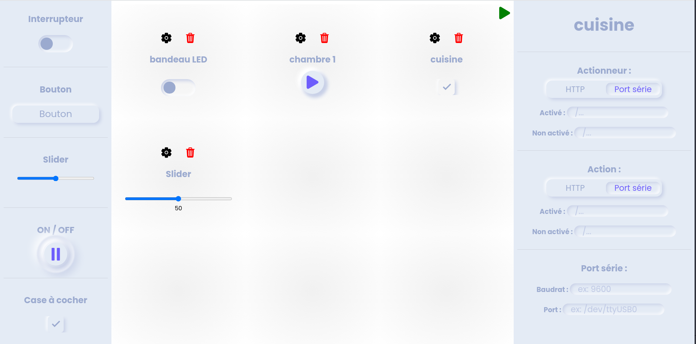

Anydomo est une interface de gestion modulaire pour vos appareils domotiques

## Lancer

    deno run -A --unstable --no-check main.ts 

## protocoles

 |nom                          |compatibilité                  |
-------------------------------|-----------------------------|
| HTTP           | supporté         |
 |Port série          |à venir          |

 
